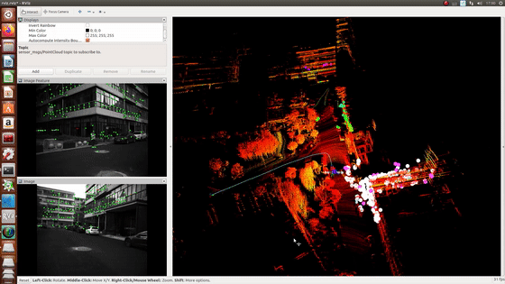
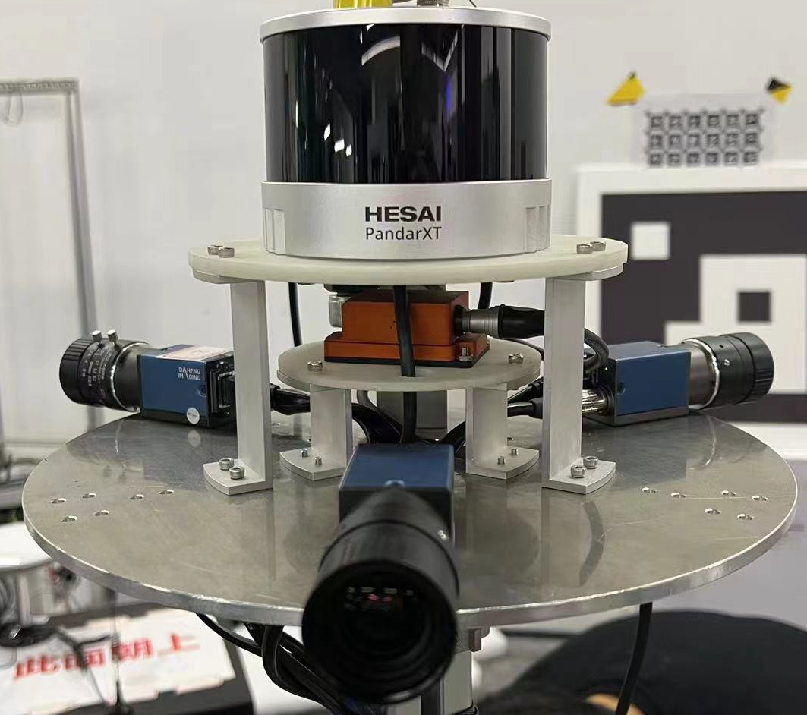

# EMV-LIO
## An Efficient Multiple Vision aided LiDAR-Inertial Odometry

**EMV-LIO** is an Efficient Multiple vision aided LiDAR-inertial odometry system based on **LVI-SAM**, which introduces multiple cameras in the VIO subsystem to expand the range of visual observation to guarantee the whole system can still maintain the relatively high accuracy in case of the failure of the monocular visual observation. Apart from this, an efficiency-enhanced LVIO system is also introduced to increase the system’s efficiency, including removing LiDAR’s noise via range image, setting condition for nearest neighbor search, and replacing kd-Tree with ikd-Tree. 

Our implementation will be available upon acceptance

<p align='center'>
    
</p>

---

## 1. Prerequisites

### 1.1 **Ubuntu** and **ROS**
Ubuntu 64-bit 16.04 or 18.04.
ROS Kinetic or Melodic. [ROS Installation](http://wiki.ros.org/ROS/Installation) and its additional ROS pacakge:

### 1.2. **Ceres Solver**
Follow [Ceres Installation](http://ceres-solver.org/installation.html).

```
  sudo apt-get install -y libgoogle-glog-dev
  sudo apt-get install -y libatlas-base-dev
  wget -O ~/Downloads/ceres.zip https://github.com/ceres-solver/ceres-solver/archive/1.14.0.zip
  cd ~/Downloads/ && unzip ceres.zip -d ~/Downloads/
  cd ~/Downloads/ceres-solver-1.14.0
  mkdir ceres-bin && cd ceres-bin
  cmake ..
  sudo make install -j4
```

### 1.3. **GTSAM**

Install the dependencies
```
sudo apt-get install libboost-all-dev
sudo apt-get install cmake
sudo apt-get install libtbb-dev
```
Compile the GTSAM's code 
```
git clone https://bitbucket.org/gtborg/gtsam.git
cd gtsam/
mkdir build &&cd build
cmake ..
make check 
sudo make install 
```

---

## 2. Compile
You can use the following commands to download and compile the package.

```
cd ~/emv_ws/src
git clone https://github.com/BingqiShen/EMV-LIO.git
cd ..
catkin_make -j4
```

---

## 3. Run our examples


### 3.1 Download our rosbag files

<p align='center'>
    
</p>

The datasets used in the paper can be downloaded from Google Drive. The data-gathering sensor suite includes: HESAI PandarXT-32 LiDAR, DAHENG MER2-202 camera, and Xsens MTi-300 IMU.

···
url：https://pan.baidu.com/s/1QjQzn1ZwN1SHqHPghYN2tw 
code：sreu 
```

### 3.2 Run the package

1. Configure parameters:

```
Configure sensor parameters in the .yaml files in the ```config``` folder.
```

2. Run the launch file:
```
roslaunch emv_lio run.launch
```

3. Play existing bag files:
```
rosbag play jz.bag 
```

---

## 4. Acknowledgement
Our repository mainly develops from [LVI-SAM](https://github.com/TixiaoShan/LVI-SAM), where the visual-inertial odometry module is adapted from [Vins-Mono](https://github.com/HKUST-Aerial-Robotics/VINS-Mono) and the lidar-inertial odometry module is adapted from [LIO-SAM](https://github.com/TixiaoShan/LIO-SAM/tree/a246c960e3fca52b989abf888c8cf1fae25b7c25). Besides, our implementation also use the codes of [ikd-Tree](https://github.com/hku-mars/ikd-Tree) and [M-LOAM](https://github.com/gogojjh/M-LOAM).
